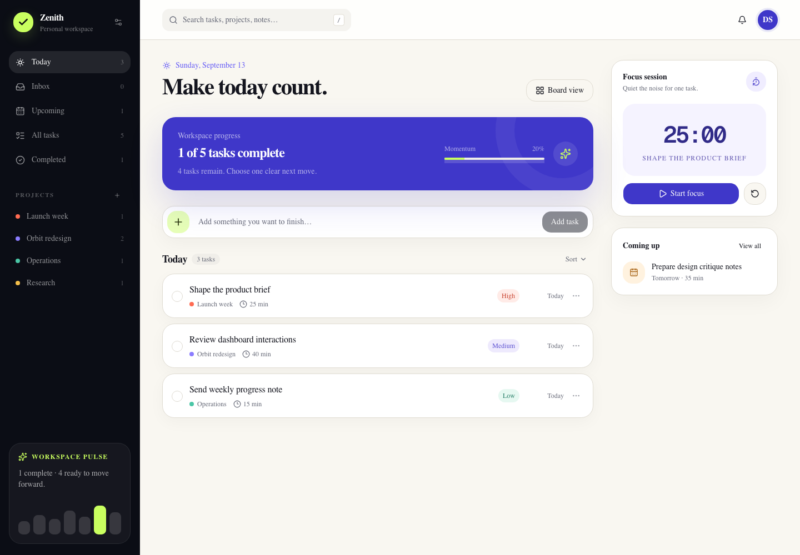
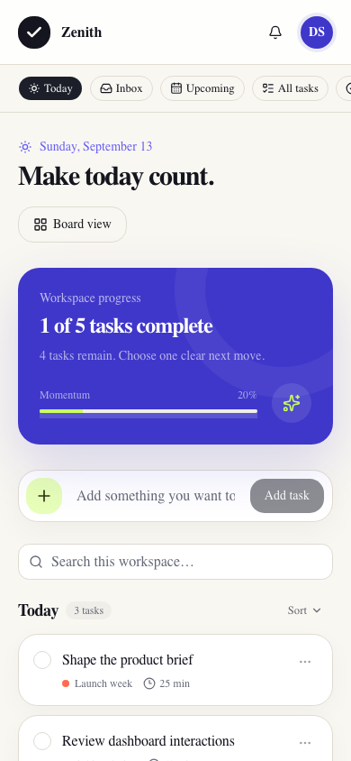

# Zenith Dynamic Task Workspace

Zenith is a full-stack productivity workspace that combines a responsive task interface with durable SQLite-compatible storage, API-backed mutations, focused planning views, and browser-tested interactions.

## Product tour



The first screen is the working surface: users can add a task immediately, understand current progress, switch between meaningful views, and begin a focus session without passing through a marketing page.



The compact layout keeps the same task flow, moves search into the working area, and turns task views into a horizontally scrollable navigation strip.

## Features

- Durable create, read, update, and delete operations through server API routes
- Today, Inbox, Upcoming, All Tasks, Completed, and project-specific views
- Search across titles, notes, projects, and priorities
- Priority, due-date, and alphabetical sorting
- List and board layouts
- Task editor with project, priority, notes, due date, and time estimate
- Explicit deletion confirmation
- Dynamic completion progress and workspace counts
- Working 25-minute focus timer with pause and reset
- Responsive mobile navigation
- Loading, error, and empty states
- Keyboard shortcut: press `/` to focus task search
- An experimental WebMCP `create_task` surface when the browser supports it

## Technology

- React 19, TypeScript, Vinext, and Vite
- Tailwind CSS and accessible Base UI/Shadcn primitives
- Cloudflare-compatible route handlers
- D1/SQLite with Drizzle-managed schema migrations
- Lucide icons

## Run locally

Requirements: Node.js 22.13 or newer.

```bash
npm install
npm run db:migrate:local
npm run db:seed:local
npm run dev
```

Open `http://localhost:3000`.

The seed command is idempotent: it uses fixed demonstration IDs with `INSERT OR IGNORE`, so rerunning it does not duplicate the sample tasks.

## Validation

With the development server running:

```bash
npm run test:smoke
npm run lint
npm run build
```

The smoke test lists tasks, creates a temporary record, updates and completes it, deletes it, and cleans up if an intermediate assertion fails.

Browser verification covers quick-add, editing, completion, Completed filtering, deletion confirmation, layout switching, focus timer behavior, and persistence after reload.

Chrome DevTools verification also confirmed a 390px mobile viewport with no document-level horizontal overflow.

## API

| Method | Route | Purpose |
|---|---|---|
| `GET` | `/api/tasks` | List ordered tasks |
| `POST` | `/api/tasks` | Validate and create a task |
| `PATCH` | `/api/tasks/:id` | Update task fields or completion |
| `DELETE` | `/api/tasks/:id` | Delete one task |

## Documentation

- [Design and architecture](./DESIGN.md)
- [Implementation checklist](./IMPLEMENTATION_PLAN.md)
